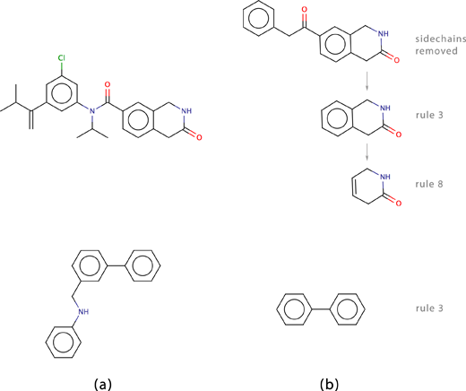

.. _1.0.2/strip-it:

##########
|strip-it|
##########

.. contents:: Table of contents
   :backlinks: none

.. admonition:: Copyright

   |copy| Copyright 2012-2013 by Silicos-it, a division of Imacosi BVBA

   Strip-it is free software; you can redistribute it and/or modify
   it under the terms of the GNU Lesser General Public License as published 
   by the Free Software Foundation, either version 3 of the License, or
   (at your option) any later version.

   Strip-it is distributed in the hope that it will be useful,
   but without any warranty; without even the implied warranty of
   merchantability or fitness for a particular purpose. See the
   `GNU Lesser General Public License <http://www.gnu.org/licenses/>`_
   for more details.

   Strip-it is linked against **OpenBabel** 
   version 2. **OpenBabel** is free software; 
   you can redistribute it and/or modify it under the terms of the GNU 
   General Public License as published by the Free Software Foundation 
   version 2 of the License.

.. admonition:: Version

   Strip-it 1.0.2

.. admonition:: Feedback

   Join our `Google groups community 
   <http://groups.google.com/group/silicos-it-chemoinformatics>`_
   to talk about inconsistencies, errors, raise questions or to make suggestions 
   for improvement.
   

************
Introduction
************

|strip-it| is a program that identifies and extracts predefined scaffolds from organic small molecules. 
The program is linked against the open source C++ library of **OpenBabel**. 

The program comes with a number of predefined molecular scaffolds for extraction. These scaffolds 
include, amongst others:

* Molecular frameworks as originally described by Bemis and Murcko [#murcko]_; 
* Molecular frameworks and the reduced molecular frameworks as described by Ansgar Schuffenhauer and 
  coworkers [#schuffenhauer]_; 
* Scaffold topologies as described by Sara Pollock and coworkers [#pollock]_. 

All of these scaffolds are explained in the following sections.

|strip-it| is instructed by means of command line options and a ‘scaffold’ file. It is by means of 
the ‘scaffold’ file that the user defines one or more of the predefined scaffolds to be extracted. 
:ref:`Figure 1<1.0.2/stripit_figure01>` describes the actual data flow.

.. _1.0.2/stripit_figure01:

   Figure 1. The input and output flow of molecules and associated files in the program |strip-it|. 
   Command line options are also indicated.

*****
Usage
*****

.. highlight:: console

Command line interface
======================

|strip-it| is run from the command line as follows::

   > strip-it [options]

Options can be *required* or *optional*. If one or more of the *required* options is missing, 
the program stops and displays an error message. Specifying the :option:`-h` or :option:`--help` 
options displays the help message:

.. literalinclude:: /_static/strip-it.txt

One option is *required*:

:option:`--input` *<file>*
	Specifies the filename containing the input molecules. The input file should contain one or 
	more molecules specified as a set of connection tables according specific molecular formats. 
	The format of these connection tables is specified by the input filename extension
	or by the :option:`--inputFormat` option. 
	The allowed input formats are those that are supported by 
	**OpenBabel**. Zipped-formats are also allowed.

.. tip::

	Use ``obabel -L formats read`` and ``obabel -L formats write`` to get a list of all read and write 
	formats recognized by **OpenBabel**.

and all other options are *optional*:

:option:`--output` *<file>*
	Specifies the name of the file to which the generated scaffolds are written. The output file 
	contains the generated scaffolds in a specific format. The first line is a header that contains 
	the names of the generated scaffolds. These names are identical to the keywords that define 
	the desired scaffolds (see the :ref:`scaffold definitions<1.0.2/scaffold_definitions>` section below). 
	The subsequent lines in the output file are composed of the generated scaffolds, with the data 
	for each input molecule on a separate line. Scaffolds are represented in a SMILES  notation.
	If the  :option:`--output` option is not provided, then all output is written to standard output.
	In the current version of |strip-it|, stereochemistry, either implicitly or explicitly defined in 
	the molecule, is removed before the actual scaffold generation takes place.
	If a molecule cannot be converted to a scaffold, for example in the case when the molecule contains 
	no rings, then a '``-``' character is written to the output file.

:option:`--inputFormat` *<format>*
	This option specifies the format of the input file. The format specification should be one of the 
	formats as recognised by **OpenBabel**. If this option is not specified, then the respective format
	is extracted from corresponding file extension. This is the default behavior.

:option:`--scaffolds` *<file>*
	This option specifies the file in which the keywords are contained that describe the scaffolds that need 
	to be generated. A detailed overview of the specific scaffold keywords that are recognised is provided
	in the :ref:`scaffold definitions<1.0.2/scaffold_definitions>` section. If the :option:`--scaffolds` option 
	is not provided, then by default all scaffold types are calculated.

:option:`--noLog`
	Specifying this optional command line option suppresses the generation of additional information during 
	the calculation process.
	
:option:`--noHeader`
	Specifying this optional command line option suppresses the header line from being printed in the output.

.. _1.0.2/scaffold_definitions:

Scaffold definitions
====================

The scaffold definition file (:option:`--scaffold`) contains the names of all the specific scaffolds 
that should be extracted from each input molecule. Scaffolds are defined by means of keywords. 
The program recognizes only the keywords that are defined in this section.

Each line should contain only a single scaffold keyword. Blanc lines, or lines starting with ‘``#``’ or 
‘``//``’ are ignored. These latter can be used as comment lines.

Keywords may be multiple repeated in a single scaffold definition file. In this case the specific 
scaffold is generated and written out more than once. Scaffold keyword definitions are case-insensitive. 
Hence, the ``Scaffold_1`` keyword is interpreted as being identical to ``SCAFFOLD_1`` or ``scaffold_1``. 
However, these keywords are not the same as ``scaffold1``.

Each scaffold keyword is composed of a *type* specification and a *number*. The *type* specification 
describes the type of scaffold, and the *number* defines the specific flavor of the specific scaffold *type*.
*Type* and *number* are concatenated by a underscore (‘_‘) character.

Rings_with_linkers
------------------

The *rings_with_linkers* scaffold type is probably the most simple of all. In its most basic form, 
the scaffold is generated by iteratively removing all atoms having a bond connectivity of less or equal to one, 
until no such atoms remain. A couple of flavors exist of the *rings_with_linkers* scaffold which mainly 
differ in the way how exocyclic and exolinker double bonds are treated.

.. rubric::  RINGS_WITH_LINKERS_1

The ``RINGS_WITH_LINKERS_1`` scaffold is generated by iteratively removing all atoms with a bond connectivity of 
less or equal to one. What remains is a scaffold composed solely of the rings and linkers of the original 
molecule (:ref:`Figure 2<1.0.2/stripit_figure02>`). Atom elements and bond orders of the original molecule are kept 
unchanged in the resulting fragment.

.. _1.0.2/stripit_figure02:

   Figure 2. (a) Original molecule, (b) ``RINGS_WITH_LINKERS_1`` scaffold.

.. rubric::  RINGS_WITH_LINKERS_2

The ``RINGS_WITH_LINKERS_2`` scaffold differs from ``RINGS_WITH_LINKERS_1`` by the fact that the 
exocyclic and exolinker =O functional groups in the original molecule are left intact in the 
generated scaffold (:ref:`Figure 3<1.0.2/stripit_figure03>`).

.. _1.0.2/stripit_figure03:

   Figure 3. (a) Original molecules, (b) ``RINGS_WITH_LINKERS_2`` scaffolds.

Murcko
------

The *murcko* scaffold type has been originally described by Bemis and Murcko [#murcko]_.

.. rubric::  MURCKO_1

An example of the ``MURCKO_1`` scaffold as implemented in the current version of |strip-it| is 
given in :ref:`Figure 4<1.0.2/stripit_figure04>`.

.. _1.0.2/stripit_figure04:

   Figure 4. (a) Original molecule, (b) ``MURCKO_1`` scaffold.

.. rubric::  MURCKO_2

The ``MURCKO_2`` scaffold differs from the ``MURCKO_1`` scaffold by the way linkers are represented. 
In the ``MURCKO_2`` scaffold these linkers are all condensed to a single chain as shown in 
:ref:`Figure 5<1.0.2/stripit_figure05>`.

.. _1.0.2/stripit_figure05:

   Figure 5. (a) Original molecule, (b) ``MURCKO_2`` scaffold.

Oprea
-----

The *oprea* scaffold type has been originally described by Pollock and coworkers [#pollock]_. In 
the current version of |strip-it|, a number of flavours of this scaffold type have been implemented. 

In all cases, the minimal SMILES representation of the different scaffolds is returned.

.. rubric::  OPREA_1

Examples of the ``OPREA_1`` scaffold type are given in :ref:`Figure 6<1.0.2/stripit_figure06>`. From all the 
implemented *oprea* scaffolds in the current version of |strip-it|, this type is closest to the 
original description of the publication.

.. _1.0.2/stripit_figure06:

   Figure 6. (a) Original molecules, (b) ``OPREA_1`` scaffolds.

.. rubric::  OPREA_2

The ``OPREA_2`` scaffold type differs from the ``OPREA_1`` scaffold by the fact that all the 
existing hydrogen bonding acceptor and donor information of the ring atoms in the original 
molecule is kept intact and transferred into the resulting scaffold. Hydrogen bond acceptor 
atoms in the original molecule are represented by oxygen atoms in the final scaffold, while 
hydrogen bond donor atoms are represented by nitrogen atoms in the scaffold. Amide or sulfoxide 
ring oxygens are treated as being part of the ring and set to hydrogen bond acceptors. All 
other atoms are replaced by saturated carbon atoms and all bond orders are set to one. Neighbouring 
ring atoms which are of the same type (hydrogen bond acceptor, hydrogen bond donor and carbon) are 
merged together into a single atom of the corresponding type. Linkers are replaced by a single bond
(:ref:`Figure 7<1.0.2/stripit_figure07>`).

.. _1.0.2/stripit_figure07:

   Figure 7. (a) Original molecules, (b) ``OPREA_2`` scaffolds.

.. rubric::  OPREA_3

The ``OPREA_3`` scaffold type differs from the ``OPREA_2`` scaffold by the fact that the hydrogen 
bonding acceptor and donor information of both the linker and ring atoms in the original molecule 
are kept and transferred into the resulting scaffold. Flanking atoms within rings and linkers that 
have the same type (hydrogen bond acceptor, hydrogen bond donor and carbon) are merged together 
into a single atom of the corresponding type (:ref:`Figure 8<1.0.2/stripit_figure08>`).

.. _1.0.2/stripit_figure08:

   Figure 8. (a) Original molecules, (b) ``OPREA_3`` scaffolds.

Schuffenhauer
-------------

The *schuffenhauer* scaffold type has been originally described by Ansgar Schuffenhauer and coworkers 
[#schuffenhauer]_.

.. rubric::  SCHUFFENHAUER_1

``SCHUFFENHAUER_1`` scaffolds are generated by removing in an iterative fashion all rings of the molecule 
until a single ring remains, unless it is not possible to tag the remaining rings in an unambigious way. 
In such cases where two or more choices are possible, the generated ``SCHUFFENHAUER_1`` scaffold will consist 
of two or more rings. A couple of examples of the ``SCHUFFENHAUER_1`` scaffold as implemented in the current 
version of |strip-it| is given in :ref:`Figure 9 <1.0.2/stripit_figure09>`.

.. _1.0.2/stripit_figure09:

   Figure 9. Examples of the ``SCHUFFENHAUER_1`` scaffold type. The second example illustrates a typical 
   case where none of the two remaining cycles can be uniquely be tagged for removal. In such case, 
   the procedure stops at this stage. (a) Original molecules, (b) ``SCHUFFENHAUER_1`` scaffolds.

When additional logging is requested when running |strip-it| (program option :option:`--noLog` not set), 
the program will output each rule that is used in stripping each appropriate cycle. The rule numbering 
corresponds to the steps as described in the original Schuffenhauer publication [#schuffenhauer]_.

.. rubric::  SCHUFFENHAUER_2

``SCHUFFENHAUER_2`` scaffolds are generated in the same way as ``SCHUFFENHAUER_1`` scaffolds, but the 
procedure stops from the moment that two rings remain, unless it is not possible to tag the remaining 
rings in an unambigious way. In such cases, the generated ``SCHUFFENHAUER_2`` scaffold will consist of 
three or more rings.

.. rubric::  SCHUFFENHAUER_3

``SCHUFFENHAUER_3`` scaffolds are generated in the same way as ``SCHUFFENHAUER_1`` scaffolds, but the 
procedure stops from the moment that three rings remain, unless it is not possible to tag the remaining 
rings in an unambigious way. In such cases, the generated ``SCHUFFENHAUER_3`` scaffold will consist of 
four or more rings.

.. rubric::  SCHUFFENHAUER_4

``SCHUFFENHAUER_4`` scaffolds are generated in the same way as ``SCHUFFENHAUER_1`` scaffolds, but the 
procedure stops from the moment that four rings remain, unless it is not possible to tag the remaining 
rings in an unambigious way. In such cases, the generated ``SCHUFFENHAUER_4`` scaffold will consist of 
five or more rings.

.. rubric::  SCHUFFENHAUER_5

``SCHUFFENHAUER_5`` scaffolds are generated in the same way as ``SCHUFFENHAUER_1`` scaffolds, but the 
procedure stops from the moment that five rings remain, unless it is not possible to tag the remaining 
rings in an unambigious way. In such cases, the generated ``SCHUFFENHAUER_5`` scaffold will consist of 
six or more rings.

Timings and number of scaffolds
===============================

The time needed for the calculation of the scaffolds depends strongly on the type of scaffold. 
In the following table, a summary is given on the relative timings for each of the implemented 
scaffold types (expressed as compounds per second). These timings have been generated by performing 
the analysis on 100,000 randomly selected drug-like molecules. In addition to the calculation time 
for each scaffold, the table also gives the number of unique scaffolds that are generated from the 
100,000 molecules in the input file::

    Scaffold                Relative time       Number of scaffolds
    --------------------   ---------------      -------------------
    RINGS_WITH_LINKERS_1               108                   49,128
    RINGS_WITH_LINKERS_2                82                   52,620
    MURCKO_1                           106                   16,124
    MURCKO_2                           108                    5,349
    OPREA_1                            105                      475
    OPREA_2                             94                    7,328
    OPREA_3                             93                   16,243
    SCHUFFENHAUER_1                      7                      462
    SCHUFFENHAUER_2                      9                    7,595
    SCHUFFENHAUER_3                     10                   33,267
    SCHUFFENHAUER_4                     13                   47,786
    SCHUFFENHAUER_5                     16                   50,827

************
Installation
************

Installation of the |strip-it| program relies on the libraries of **OpenBabel**
version 2.3. Installation of **OpenBabel** 
is exemplified in the 
:ref:`Configuring OS X for chemoinformatics <configuring_osx_for_chemoinformatics>` 
section of this website.

The installation of |strip-it| assumes that the :envvar:`BABEL_DATADIR`, 
:envvar:`BABEL_LIBDIR`, and :envvar:`BABEL_INCLUDEDIR` point to the directories 
where **OpenBabel** has been installed::

	> echo $BABEL_INCLUDEDIR
	/usr/local/openbabel/include/openbabel-2.0/
	> echo $BABEL_LIBDIR
	/usr/local/lib/openbabel/2.3.1/
	> echo $BABEL_DATADIR
	/usr/local/openbabel/share/openbabel/2.3.1/

Start by downloading |strip-it| from our :ref:`software <software>` section and
un-tar this file into the :file:`/usr/local/src` directory::

	> cd /usr/local/src
	> sudo tar -xvf ~/Downloads/strip-it-1.0.2.tar.gz

Change into this directory and start the building process::

	> cd strip-it-1.0.2
	> sudo mkdir build
	> cd build
	> sudo cmake ..
	> sudo make
	> sudo make install
	
This latter command will install the |strip-it| executable in the 
:file:`/usr/local/bin/` directory.
Finally, check the installation by entering::

	> make test
	
This should complete all tests without errors.

**********
References
**********

.. [#murcko] Bemis, G.W.; Murcko, M.A. (1996) ‘The properties of known drugs. 1. Molecular frameworks’,
   *J. Med. Chem.* **39**, 2887-2893 [`pubmed/8709122 <http://www.ncbi.nlm.nih.gov/pubmed/8709122>`_]

.. [#schuffenhauer] Schuffenhauer, A.; Ertl, P.; Roggo, S.; Wetzel, S.; Koch, M.A. & Waldmann, H. 
   (2007) ‘The scaffold tree - visualization of the scaffold universe by hierarchical scaffold 
   classification’, *J. Chem. Inf. Model.* **47**, 47-58 
   [`pdf <http://peter-ertl.com/reprints/Schuffenhauer-JCIM-47-47-2007.pdf>`_]

.. [#pollock] Pollock, S.N.; Coutsias, E.A.; Wester, M.J. & Oprea, T.I. (2008) ‘Scaffold 
   topologies. 1. Exhaustive enumeration up to eight rings’, *J. Chem. Inf. Model.* **48,** 1304-1310
   [`pubmed/18605680 <http://www.ncbi.nlm.nih.gov/pubmed/18605680>`_]

 

****************
Revision history
****************

Version 1.0.2
==============

Added the :option:`--noHeader` option (based on a patch provided by Björn Grüning from the
University of Freiburg).

Version 1.0.1
==============

Added the :option:`--inputFormat` option (based on a patch provided by Björn Grüning from the
University of Freiburg).

Version 1.0.0
==============

This is the first official release of |strip-it|. The program is a successor of the program *Stripper*
from Silicos, and is branched out of version 1.0.4 of *Stripper*.

Additions to the original *Stripper* version include:

* Porting the documentation to ``html`` and including some improvements.
